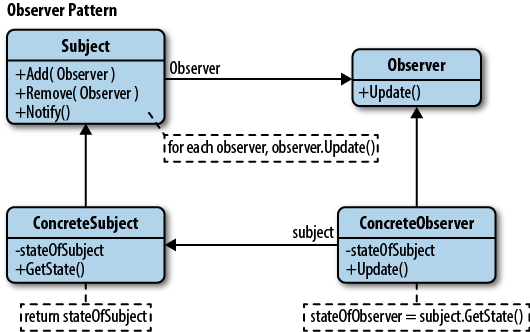

# Observer Design Pattern
***

#### Observer is a Behavioral Design Pattern that lets you define a subscription mechanism to notify multiple objects about any events that happen to the object they are observing.

Observer Design Pattern defines a one-to-many dependency between objects where: 

1. One object is the **"Observable"** (Subject/Publisher) and
2. Other objects are **"Observers"** (Subscribers)

The **Observable** notify all the Observers when a change occurs in its state.
The **Observers** listen to the changes of the Observable.

The Observer Design Pattern can be implemented with the following structure:
* An IObservable interface (that can be observed) that can be observed by many observers/subscribers.
* An IObserver interface (that can observe) that observes one observable/subject/publisher.
* A ConcreteObservable that implements IObservable.
* A ConcreteObserver that implement IObserver.

Here I have implemented the Observer Design Pattern using an example of Newsletter subscription.

Whenever a new newsletter is published, the subcribers that have subscribed to that specific Newsletter will be notified.

In the above example _NewsletterPublisher_ is an abstract class that derives directly from the IObservable interface. 

The _WeeklyNewsletter_ and _PromotionalNewsletter_ further are concrete publishers that extend the _NewsletterPublisher_ class, inheriting the subscription behavior.