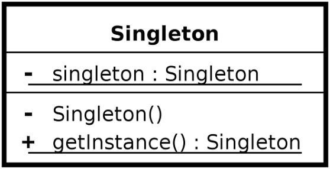

# Singleton Design Pattern
***
#### Singleton is a Creational Design Pattern that ensures two main things:

1. That a class has just a **single instance**
2. Provides a **global access point** to that instance

***

In order to achieve this we need to follow this structure:

This basically means that you need:

* A **static** _(underlined)_ and **private** _(-)_ **instance** of the class
* A **private** _(-)_ **constructor**
* A **public** _(+)_ and **static** _(underlined)_ **function** that returns  the instance

#### This implementation (with additional double-check locking) can be found in the SingletonClass.cs file

